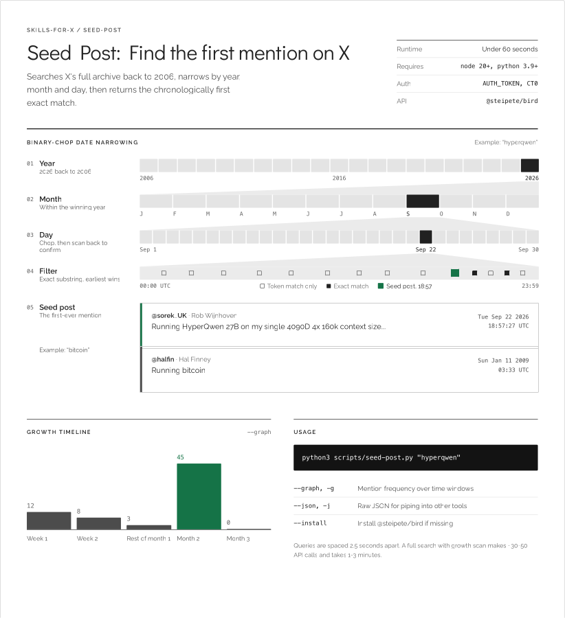

# seed-post

Find the first-ever mention of any phrase on X/Twitter.



## Quick start

```bash
# 1. Install dependencies
npm install

# 2. Add your X cookies
cp .env.example .env
# Edit .env with your auth_token and ct0 from x.com

# 3. Run it
python3 scripts/seed-post.py "bitcoin"
```

## Flags

| Flag | What it does |
|------|-------------|
| `--graph` / `-g` | Show growth timeline (mention frequency over time) |
| `--annual` | Calendar-year growth windows (for long-running terms) |
| `--window 30d` | Custom window size: `7d`, `30d`, `3m`, `1y` |
| `--shares N` | Show first N early mentions after the seed post |
| `--after 2020-01-01` | Only search after this date |
| `--before 2021-01-01` | Only search before this date |
| `--json` / `-j` | Raw JSON output (machine-readable) |
| `--install` | Auto-install missing npm dependencies |

## Requirements

- Node.js >= 20 (for [@steipete/bird](https://github.com/steipete/bird) GraphQL CLI)
- Python >= 3.10
- X account cookies (auth_token + ct0)

## How it works

The script uses X's internal GraphQL API (via `@steipete/bird`) to search the full archive back to 2006. It binary-chops by year → month → day, filters exact matches client-side, and returns the chronologically first post. The growth scan probes time windows from the OG post date to today.

## License

MIT